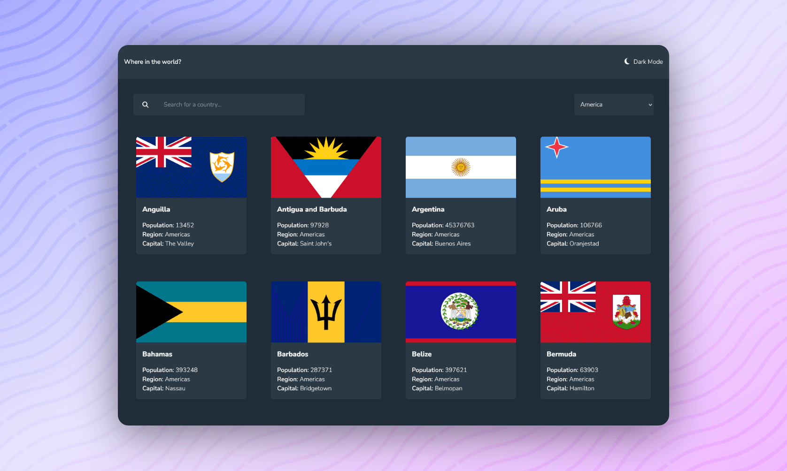

<h1 align="center">REST Countries API with color theme switcher</h1>

<h2 align="center">

[🌐WebSite](https://rest-countries-codepapa.vercel.app) || [Solution]()

</h2>

<!-- Badges -->
<div align="center">


<!-- Liceensee -->


<br/>
<a href='https://www.twitter.com/CodePapa360' target="_blank"></a>
<a href='https://www.linkedin.com/in/codepapa360' target="_blank"></a>

</div>

<!-- Brief -->
<p align="center">
This project is a practical exploration of React, React Router, and Redux Toolkit. It's a dynamic web application that allows users to explore and learn about countries from around the world. It's been a journey of challenges, learning, and growth, with a focus on improving my development skills and problem-solving abilities.
</p>

<!-- Screenshot -->
<a align="center" href="https://rest-countries-codepapa.vercel.app">



</a>

## Key Features

Users should be able to:

- See all countries from the API on the homepage
- Search for a country using an `input` field
- Filter countries by region
- Click on a country to see more detailed information on a separate page
- Click through to the border countries on the detail page
- Toggle the color scheme between light and dark mode _(optional)_

## Built with

- [React](https://reactjs.org) - A JavaScript library for building user interfaces
- [Redux Toolkit](https://redux-toolkit.js.org) - A simplified, efficient, and powerful Redux library for building state management systems
- [Redux Router](https://reactrouter.com/en/main) - Declarative routing for React applications
- [Tailwind CSS](https://tailwindcss.com) - Utility-first CSS framework for building any design
- HTML5
- Mobile-first workflow
- [Vite](https://vitejs.dev/) - A JavaScript module bundler and development server.

## What I Learned

Throughout this project, I encountered some interesting challenges while learning React, React Router, and Redux Toolkit.

- **Embracing Challenges:** I faced some tricky issues while working on the project, like handling complex state and integrating data. These challenges, while tough, were the moments when I learned the most.

- **Becoming a Detective:** Debugging became my new superpower. I spent a lot of time hunting down bugs and troubleshooting issues. It was frustrating at times, but it made me better at fixing things.

- **The Importance of Planning:** I discovered that having a plan and an organized structure for my project can save a lot of time and reduce stress.

## Installation

- Clone this repo:

```sh
git clone https://github.com/CodePapa360/REST-Countries.git
```

- Install dependencies:

```sh
npm install
```

- Build command:

```sh
npm run build
```

- Live server:

```sh
npm run dev
```

## Author

<b>👤 Alamin</b>

- Twitter - [@CodePapa360](https://www.twitter.com/CodePapa360)
- LinkedIn - [@CodePapa360](https://www.linkedin.com/in/codepapa360)
- Frontend Mentor - [@CodePapa360](https://www.frontendmentor.io/profile/CodePapa360)
- Github: [@CodePapa360](https://github.com/codepapa360)

Feel free to contact me with any questions or feedback!

## Acknowledgments

The project was inspired by this challenge from Frontend Mentor. Special thanks to Frontend Mentor for providing the design and specifications for this project.

## License

This project is licensed under the [MIT](./LICENSE.md) License - see the LICENSE file for details.
